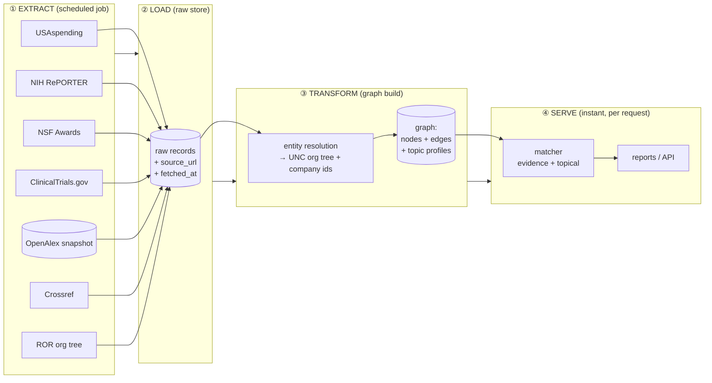

# UNC Partnership Research Graph — How It Works and How to Build It

*A build spec for the research/intelligence side of `map-elt-research-graph`. Constraint: free, public, keyless, no LLM in the path. The goal is mapping and report enrichment — not outreach.*

---

## 0. The one-paragraph mental model

You are not building a thing that "looks up a company's UNC links on demand." You are building a **graph of UNC's public research footprint that you compute once and refresh on a schedule**, then answer every question as a fast lookup against it. Nodes are UNC units, faculty, and companies. Edges are concrete public records — a grant, a paper, a trial, a patent — each carrying its own source URL and a date. "Is company X a UNC partner?" and "which UNC departments fit sector Y?" both become queries over that graph. The expensive work (harvesting and normalizing) happens at **build time**; the user-facing work (matching and ranking) happens at **query time** in milliseconds.

This is exactly the ELT shape your repo name already implies: **E**xtract from public APIs → **L**oad raw → **T**ransform into a graph → serve.

---

## 1. Why precompute instead of fetch live

Your current engine fetches per company under a ~44s budget. That is the right design for "profile one compan